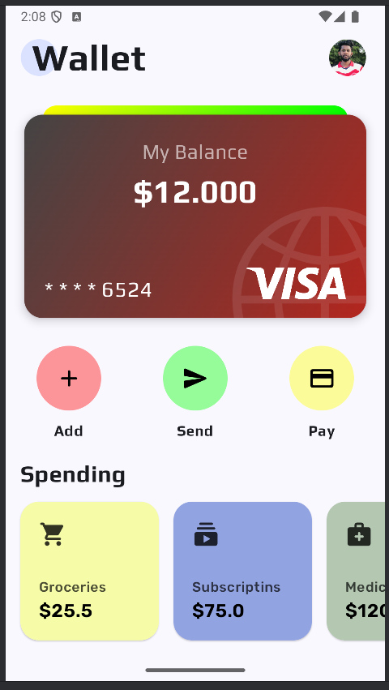
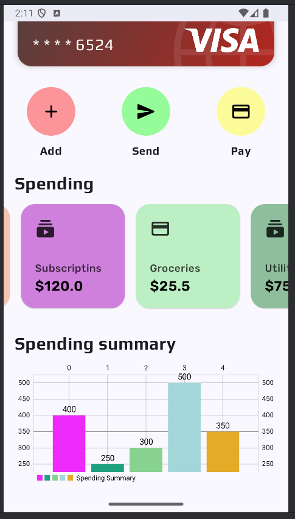

# Wallet App UI

A modern and intuitive wallet application designed to simplify your financial management. This project showcases a clean UI and functionalities of a wallet app built using Jetpack Compose in Android Studio.

## Features

- **User-Friendly Design**: Clean and modern user interface created with Jetpack Compose.
- **Customizable**: Easy to expand or modify.

## Screenshots

### Main Screen



### Spending Overview



## Installation

1. Clone the repository:
   ```bash
   git clone https://github.com/sanjula77/Wallet-App-UI.git
   ```

2. Open the project in Android Studio:
   - File > Open > Navigate to the project directory.

3. Build the project:
   - Let Android Studio sync and build the project dependencies.

4. Run the application:
   - Connect an Android device or start an emulator, then click the **Run** button.

## Usage

- Launch the app to explore the UI and features.
- Navigate through the app to view and manage transactions.

## Technologies Used

- **Kotlin**: Primary programming language.
- **Jetpack Compose**: Modern UI toolkit for building native Android UIs.
- **Android Studio**: Integrated Development Environment (IDE).
- **Gradle**: Build tool.

## Contributing

1. Fork the repository.
2. Create a feature branch:
   ```bash
   git checkout -b feature-name
   ```
3. Commit your changes:
   ```bash
   git commit -m "Add new feature"
   ```
4. Push to the branch:
   ```bash
   git push origin feature-name
   ```
5. Open a pull request.

## License

This project is licensed under the MIT License. See the LICENSE file for details.
